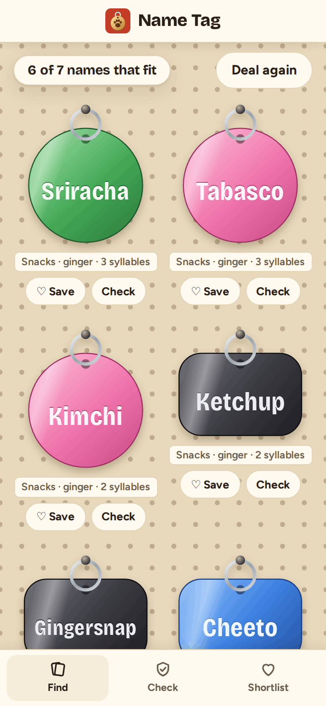
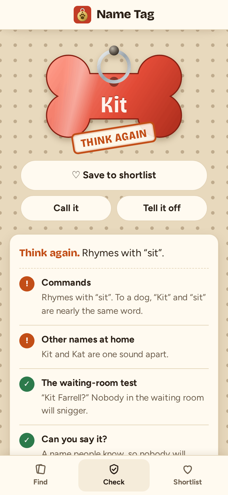
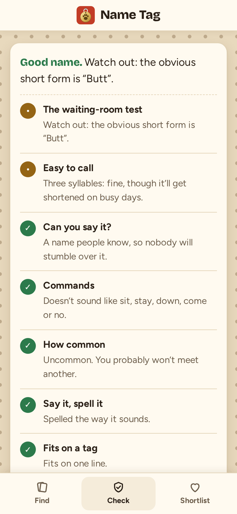
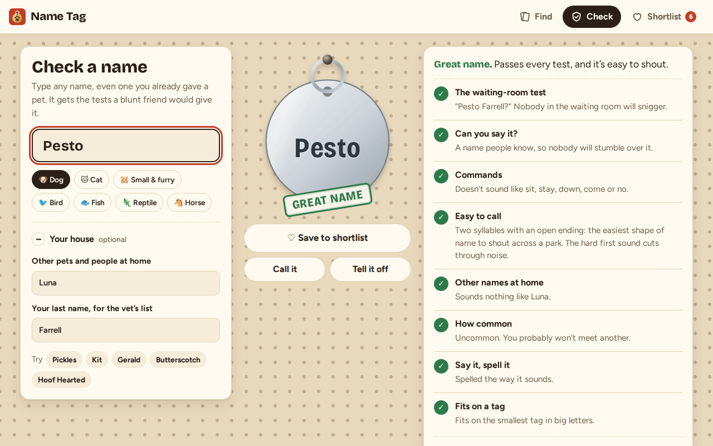

# Name Tag

**Use it: [junkdrawer.works/name-tag](https://junkdrawer.works/name-tag/)**

**Find a name for a new pet, or find out what's wrong with the one you picked.** Pick what matters, from normal things like coat colour and size to odder ones like snacks, junk-drawer finds or someone at work, and it deals six names engraved on pet tags. Type any name into Check and it gets the tests a blunt friend would give it, then a stamp from Great name down to Please don't.

<p align="center">
  
  &nbsp;
  
  &nbsp;
  
</p>

<p align="center">
  
</p>

## How it works

- **Find a name.** Pick the animal, boy or girl, and any of 22 themes: Classics, People names, Old folks, Someone at work, Posh, Famous animals, Snacks, Cheese, Drinks, Fruit & veg, Herbs & spices, Junk drawer, The wrong size, Puns, Space, Gods & myths, Nature, Colours & gems, Musicians, Books & films, Scientists and Places. **How normal?** leans the deal towards Luna and Max, or towards Allen Key and Chairman Meow.
- **Looks, size and personality.** Coat colour and personality pick names that suit them: a black, chaotic cat gets Bellatrix, Skunk and Magpie. Size picks big or tiny names, and **The wrong size** turns it around, so a Great Dane gets Peanut and a hamster gets Goliath.
- **About 1,700 names**, each tagged by hand with its themes, and where it fits, its coat, personality, size, and whether it's a boy's or girl's name. Puns only turn up for the right animal: Catsby is for cats, Bark Twain for dogs, Gill Murray for fish.
- **Easy to call** (on by default) keeps to three syllables or fewer and drops anything that sounds like a command.
- **Check a name.** It gets engraved on a tag as you type, then tested:
  - **Can you say it?** Keyboard mash, missing vowels and strings of letters nobody could read out get a Please don't. Made-up but sayable names (Blorfnax) and unfamiliar real ones (Aoife) get a gentler note.
  - **The waiting-room test:** what the vet reads out, with your last name. Rude words, prank names like Ben Dover, words you shouldn't shout in a park (Fire), and short forms that go wrong (Butterscotch becomes Butt).
  - **Commands:** one-syllable names that rhyme with sit, stay, down, come, no, heel, wait, leave it or yes. Kit, Bo and Kay all fail. Horses get whoa, walk, trot and back.
  - **Easy to call:** syllables, an open ending that carries, a hard first sound that cuts through noise.
  - **Other names at home:** type in the other pets and people, and it catches rhymes (Molly and Polly), the same start (Bella and Benny) and near misses (Kit and Kat).
  - **How common, Say it, spell it, Fits on a tag,** and a note for the animal: Lily is a lovely cat name, and lilies are poisonous to cats.
- **Great name is earned.** It needs every test passed without a single note, and one of the easiest shapes to shout: one or two syllables ending on a vowel sound, the way dog trainers recommend. About a quarter of the names in the list make it; Luna and Max are Good, because you'll meet a few.
- **Then the extras:** what it'll get called (Reginald becomes Reggie), the full name for when it's in trouble, and similar names that pass, so you can try one of those instead. **Call it** and **Tell it off** say the name out loud with the most natural voice your device has, and the **Voice** menu lets you pick another. On an iPhone, the Enhanced and Premium voices you can download under Settings → Accessibility → Spoken Content → Voices sound far better than the default.
- **Shortlist.** Save names from either side. Each one shows its stamp. **Pick one for me** draws one when you can't decide.
- No account and no server. Your picks and shortlist stay in your browser. It works offline and installs to a phone's home screen.

The sound rules are rough on purpose: English spelling doesn't follow rules, so they're tuned on the names in the list, and the tests cover the cases they get wrong.

## Running it

It's a static site: plain HTML, CSS and JavaScript modules, with no build step.

```sh
npx serve .                   # or any static file server, then open the printed address
npm install                   # only for the tools below: esbuild and upng-js
npm test                      # the checker and the dealer (Node 20+), then the real page in Chromium (needs Playwright)
node tools/screenshots.mjs    # redraws docs/*.png and og.png
node tools/make-icons.mjs     # redraws the PNG icons from icon.svg
npm run build                 # dist/name-tag.html, the whole app in one file
```

To put it online with GitHub Pages: **Settings → Pages → Build and deployment → Deploy from a branch**, then pick `main` and `/ (root)`.

### Files

- `js/names.js`: the names, one list per theme, with their tags. Adding a name means adding it to a theme; `npm test` checks the list.
- `js/sound.js`: syllables, a rough phonetic spelling, rhymes and first sounds, and other likely spellings.
- `js/check.js`: the tests, the verdict, nicknames, the full name and the names to try instead. `js/sayable.js` spots names nobody could say, by comparing letter patterns with the list.
- `js/generate.js`: filters the list by your picks and deals names by how well they fit.
- `js/tag.js`: draws a name engraved on a tag. Each name always gets the same metal and shape.
- `js/app.js`: the page. `js/store.js` saves your picks and shortlist. `js/voice.js` picks the least robotic voice for reading names aloud.
- `fonts/`: Bricolage Grotesque and Figtree, both under the SIL Open Font License, served from here so nothing loads from elsewhere.
- `sw.js`: keeps a copy for using offline.
